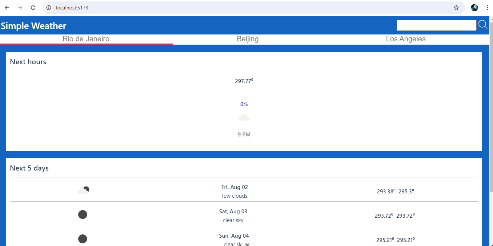

# simple-weather

**Steps to run the application:**

 1. clone the project using command: **git clone https://github.com/harishgentyala/simple-weather.git**
 2. run the command: "**npm install**" to install the required dependencies.
 3. In order to view the data and to create search results, we need to
    run two commands: a) for dev server b) for node server

Run command for dev server:  **npm run dev**

Run command for node server: **node ./node-csv-server/index.js**

open the url : [http://localhost:5173/](http://localhost:5173/) in the browser you should be able to see the page as above